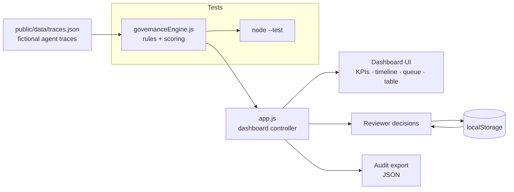
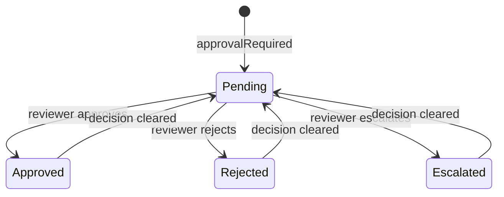
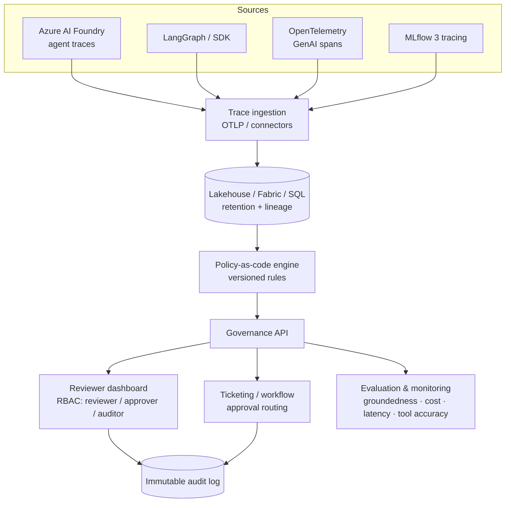

# Architecture

This document describes the **current** (local prototype) architecture and a
**future** production architecture, plus the three models that make up the
governance layer: the policy engine, the human-approval model, and the audit
model.

---

## 1. Current architecture (local prototype)

Everything runs client-side. There is no backend, no database, and no runtime
dependency — the static server only hands out files.



**Data flow**

1. `traces.json` is loaded by the browser (`fetch`).
2. `governanceEngine.js` scores each trace against the rule table.
3. `app.js` renders KPIs, the risk breakdown, the timeline, the approval queue,
   and the trace table, and wires up filtering and selection.
4. A reviewer records a decision (approve / reject / escalate + note); it is
   persisted in `localStorage` and survives reloads.
5. The current view (traces + scores + decisions) can be exported as JSON audit
   evidence.

**Key design choice:** the governance engine lives under `public/js/` and is
imported by **both** the browser (`app.js`) and the **Node test suite**. There is
a single source of truth, so the deployed UI can never diverge from what the
tests verify. (The original prototype imported the engine from a sibling `src/`
folder that the static server refused to serve — this version fixes that by
co-locating the engine inside the served root.)

---

## 2. The policy engine

The engine (`public/js/governanceEngine.js`) is a table of independent rules:

```js
{ id, label, category, weight, severity, description, test(trace) → boolean }
```

- `scoreTrace(trace)` runs every rule, sums the weights of the ones that fire
  (capped at 100), and derives a **level** (High/Medium/Low) and recommended
  **action** (Escalate/Review/Monitor) from `THRESHOLDS`.
- It returns `{ score, level, action, reasons, flags, categories,
  approvalMissing }`. `categories` is an `id → boolean` map the UI filters use.
- `summarizeTraces(traces)` aggregates counts, averages, and attaches the
  computed governance object to each trace.
- A malformed trace can never crash scoring — each rule's `test` is wrapped so a
  throw is treated as "did not fire".

Because filters (`FILTERS`) and the UI both derive from this one table, adding a
governance rule is a single append — no other file needs to change, and the test
suite already asserts the shipped dataset exercises **every** rule.

### Detection notes

- **Direct injection** scans the *user input* for override phrases.
- **Indirect injection** scans *retrieved content* (`trace.retrievedContent`) —
  modelling the "poisoned document / tool output" class of attack, where the
  malicious instruction rides in on data the agent fetched rather than on the
  user's prompt.
- **Sensitive data** fires on an explicit flag, on keywords (confidential, PII,
  password…), or on a bare email address in the input.

---

## 3. Human-approval model

Automated scoring and human judgement are kept **separate on purpose**:

- The **risk score** reflects *what the agent did* — it is evidence and never
  changes because a human clicked a button.
- The **decision** reflects *what a human concluded* — `approved`, `rejected`, or
  `escalated`, with a reviewer name, an optional note, and an ISO timestamp.

A trace enters the **approval queue** when `approvalRequired` is true and no
decision has been recorded (`pending`). Recording a decision removes it from the
queue and stamps a badge on the trace. This is the model that, in production,
gates a *write* tool: the action does not execute until the decision exists.



Decisions persist in `localStorage` (`aiagd.decisions.v1`). In production this
would be a durable, access-controlled store with an immutable history.

---

## 4. Audit model

The **Export audit JSON** action produces an evidence bundle:

```jsonc
{
  "generatedAt": "2026-07-12T13:20:00.000Z",
  "disclaimer": "Fictional demonstration data …",
  "filtersApplied": { "risk": "High", "agent": "all", "quickFilters": ["prompt_injection"] },
  "summary": { "total": 9, "high": 2, "medium": 2, "low": 5, "approvalsMissing": 5, … },
  "traces": [
    {
      "id": "trace-1003",
      "…": "…original trace fields…",
      "governance": { "score": 80, "level": "High", "action": "Escalate", "flags": [ … ] },
      "decision": { "status": "rejected", "reviewer": "m.wolski", "note": "…", "timestamp": "…" }
    }
  ]
}
```

Every exported trace carries three layers — **what happened** (the trace), **how
it scored** (governance), and **who decided what** (decision) — which is exactly
what an auditor or compliance reviewer needs to reconstruct events.

---

## 5. Future production architecture



The migration path from this prototype:

| Prototype | Production |
| --- | --- |
| `traces.json` | Streamed traces from Foundry / OTel / MLflow via OTLP or connectors |
| In-memory scoring | Policy-as-code engine with versioned, reviewed rule changes |
| `localStorage` decisions | Durable store + approval routing through a ticketing system |
| Client-side export | Immutable, access-controlled audit log with retention policies |
| Open dashboard | Authenticated dashboard with RBAC (reviewer / approver / auditor) |
| Heuristic injection rules | Dedicated guardrail / prompt-shield + content-safety services |
| Static groundedness field | Live evaluation datasets and regression tests |

See the [Observability mapping page](public/mapping.html) for how each concept
maps onto specific platforms (Azure AI Foundry, Databricks MLflow 3,
OpenTelemetry, and MCP tool governance).
