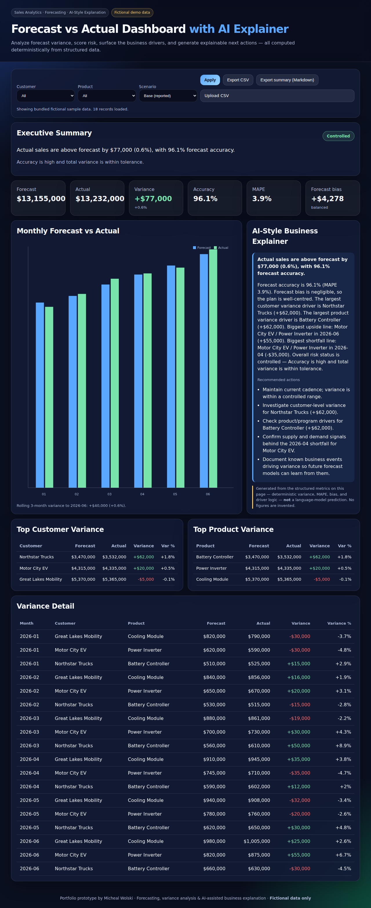

# Forecast vs Actual Dashboard with AI Explainer

A production-style portfolio prototype for **sales forecasting, variance analysis, and
AI-assisted business explanation**. It compares forecast against actual sales, scores the
forecasting risk, surfaces the customer and product drivers, and generates an explainable set
of next actions — all computed deterministically from structured data, with **no language-model
call and no invented numbers**.

> **Fictional data disclaimer.** Every figure in this project uses fictional sample data
> (`public/data/sales.json`). It contains no confidential or proprietary information from any
> company. It is a demonstration of technique, not a report on any real business.



---

## Why this project exists

It demonstrates the end-to-end thinking behind an **OE (Original Equipment) sales
decision-support tool**: turning raw forecast/actual data into KPIs, variance drivers, risk
status, and a narrative a sales manager can act on.

The design deliberately separates two concerns that are easy to blur:

1. **Analytics / forecasting logic** owns every number — totals, variance, MAPE, accuracy,
   forecast bias, rolling variance, and risk scoring.
2. **The AI-style explainer** only *translates* those computed values into business language and
   recommended actions. It never predicts or fabricates a figure.

That separation is the whole point: it is how you get GenAI-style explanations you can trust in
a reporting context.

## Relevance to a Digitalization & AI / Sales role

| Capability the role wants | Where it shows up here |
| --- | --- |
| Sales & forecasting analytics | Forecast, actual, variance, MAPE, accuracy, forecast bias |
| Variance analysis & driver hunting | Top customer / product variance, largest single over- and under-runs |
| Business intelligence / KPI reporting | KPI tiles, executive summary, exportable reports |
| Risk-based decision support | Controlled / Watch / Critical risk scoring with reasons |
| Responsible GenAI | Narrative grounded in structured metrics, explicit governance note |
| Power BI / Microsoft Fabric thinking | Explicit mapping below and in `ARCHITECTURE.md` |
| Engineering hygiene | Unit tests, CI, lint, zero-dependency build, deployable static site |

## Demo walkthrough

1. **Run it** (see below) and open the dashboard.
2. **Executive summary** at the top gives the headline variance, forecast accuracy, and a
   colour-coded **risk badge** (Controlled / Watch / Critical) with the reason.
3. **KPI tiles** show Forecast, Actual, Variance, Accuracy, MAPE, and Forecast bias.
4. **Filter** by customer and product to drill into a segment; every metric, chart, and the
   narrative recompute instantly.
5. **Scenario toggle** (Base / Optimistic / Downside) applies a demand-sensitivity band to the
   actuals so you can stress-test how KPIs and risk move — the forecast plan stays fixed.
6. **AI-style explainer** narrates the drivers and lists recommended actions, with a governance
   note stating the text is generated from the metrics, not a model.
7. **Top customer / product variance** tables rank the drivers.
8. **Export** the filtered data as **CSV**, or export an **executive-summary Markdown** report.
9. **Upload CSV** to analyze your own `month, customer, product, forecast, actual` data — it
   stays in your browser.

## Run

```bash
npm install   # no dependencies, but keeps the workflow familiar
npm start
```

Open <http://localhost:4174>.

## Test & lint

```bash
npm test        # node --test unit suite for the analytics core
npm run lint    # structure, sample-data, and analytics smoke check
```

## Analytics included

- **Forecast, actual, variance** (absolute and %)
- **MAPE** (mean absolute percentage error) and **forecast accuracy** (`1 − MAPE`)
- **Forecast bias** — signed mean error with an under-/over-forecasting tendency
- **Rolling 3-month variance**
- **Largest positive and negative variance** line items
- **Top customer / product variance** drivers
- **Risk status** — Controlled / Watch / Critical from accuracy and total variance
- **Scenario sensitivity** — Base / Optimistic / Downside

See `ARCHITECTURE.md` for the exact formulas and the AI-explainer governance model.

## How this maps to Power BI / Microsoft Fabric

This prototype is intentionally a **local, zero-dependency static app** so it is easy to read and
run. The same design maps cleanly onto a Microsoft BI stack:

| This prototype | Power BI / Fabric equivalent |
| --- | --- |
| `public/data/sales.json` sample | Fabric Lakehouse / Warehouse table, or Databricks SQL source |
| `forecastAnalytics.js` metrics | DAX measures / semantic model (variance, MAPE, accuracy, bias) |
| KPI tiles + chart | Power BI report visuals and KPI cards |
| Risk status logic | Calculation group / measure driving conditional formatting |
| Scenario toggle | What-if parameter |
| Executive-summary export | Paginated report / subscription, or Copilot narrative |
| AI-style explainer | Grounded GenAI narrative layer over the semantic model |

> This is **not** a real Power BI implementation. It is a design that demonstrates Power BI /
> Fabric-shaped thinking in a runnable form.

## Deployment

The app is a static site under `public/`. A GitHub Actions workflow
(`.github/workflows/deploy-pages.yml`) publishes it to **GitHub Pages** on every push to the
default branch. To enable it: repository **Settings → Pages → Build and deployment → Source:
GitHub Actions**. It also runs fine on Vercel or Netlify (publish directory: `public`).

## Future production roadmap

- Connect to a **Fabric Lakehouse / Warehouse** or **Databricks SQL** source instead of JSON.
- Build a real **Power BI semantic model** and report version.
- Add a genuine **time-series / ML forecast** with **backtesting** (this prototype analyzes an
  existing forecast; it does not generate one).
- Add data lineage, refresh monitoring, and automated data-quality checks.
- Add role-based access control and per-region / per-account drilldowns.
- Layer a **grounded GenAI narrative** (retrieval over the semantic model) in place of the
  deterministic explainer, keeping the same "numbers from analytics, words from AI" contract.

## Project layout

```
public/
  index.html            Dashboard markup
  styles.css            Dark-theme styling
  app.js                UI logic: filters, scenarios, chart, exports, CSV upload
  forecastAnalytics.js  Pure analytics + explainer core (browser + Node)
  data/sales.json       Fictional sample dataset
test/                   node --test unit suite
scripts/                serve, lint, and Pages build (all dependency-free)
docs/                   Screenshot(s) used in this README
```

## License

MIT © Micheal Wolski
